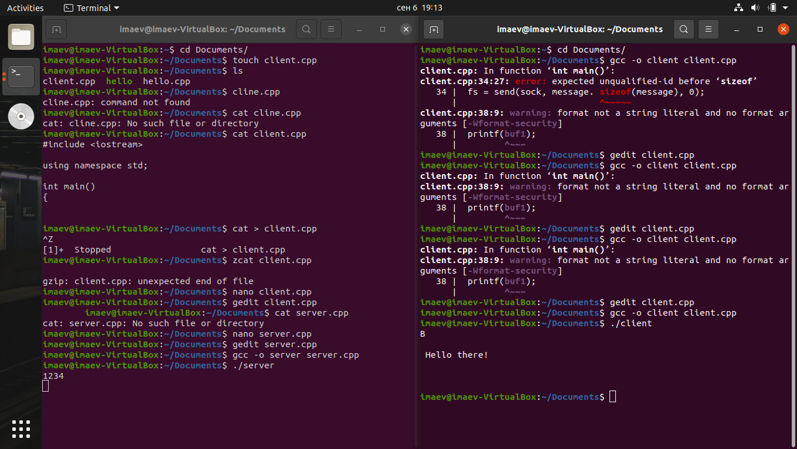

# Client-Server

The echo client sends the message " Hello there!" and displays the server response on the screen. 
Its code is given in [client.cpp](client.cpp). The echo server reads everything that the client sends to it, 
and then sends the received data back, while initializing a re-edit in order to transmit additional (its own) 
data to the client. Its code is given in [server.cpp](server.cpp).

# How to install?

> Clone repository
```
git clone https://github.com/RIDOS/Client-Server.git
```
> In the Linux console write
```
gcc -o client client.cpp
```
> And that..
```
gcc -o server server.cpp
```
